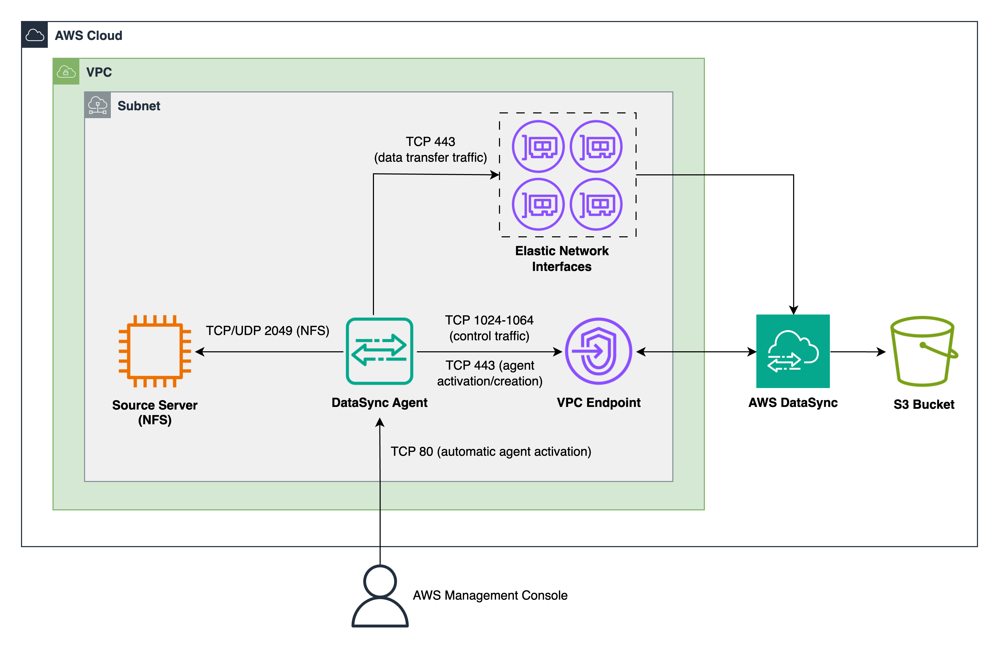

# datasync-ec2-s3-transfer

* [Move Millions of Files from Amazon EC2 to Amazon S3 using AWS DataSync](https://michaelsambol.medium.com/move-millions-of-files-from-amazon-ec2-to-amazon-s3-using-aws-datasync-a15bb31a81a1)

## Architecture

